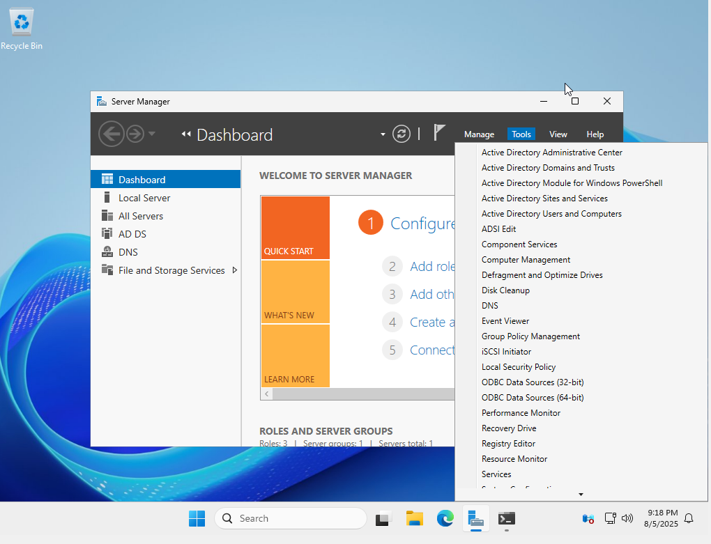

# 🖥️ Systems Administrator Lab Portfolio

This repository contains a structured collection of hands-on lab projects that simulate the responsibilities and environment of a professional Systems Administrator. Each lab is independently configured, executed, and documented to demonstrate mastery of core infrastructure technologies used in enterprise IT environments.

These labs are part of my career transition from Business Systems Analyst to Systems Administrator, and serve as a public proof-of-work portfolio to showcase technical readiness in preparation for future roles in cloud administration and cloud security.

---

## 🎯 Goals

- Build and validate enterprise-grade infrastructure using Windows Server
- Develop working knowledge of on-premises technologies foundational to hybrid cloud environments
- Automate system administration tasks using PowerShell and Bash
- Document all labs publicly with clarity, precision, and professional standards

---

## 🔧 Technologies & Tools

| Category               | Technologies Used                            |
|------------------------|----------------------------------------------|
| OS & Virtualization    | Windows Server 2025, VirtualBox, Hyper-V     |
| Identity & Access      | Active Directory Domain Services (ADDS), OUs |
| Networking             | DNS, DHCP (planned), static IP configuration |
| Policy Management      | Group Policy Objects (GPO) (upcoming)        |
| Scripting & Automation | PowerShell, Bash                             |
| Tools & Interfaces     | Server Manager, ADUC, DCDIAG, nslookup       |

---

## 📁 Lab Directory

| Lab | Description | Status |
|-----|-------------|--------|
| [adds-installation](./windows-server-lab/adds-installation) | Install and validate Active Directory Domain Services, DNS resolution, and create OUs | ✅ Completed |
| dns-configuration | Set up internal DNS zones and forwarders | 🔜 In Progress |
| gpo-lab | Apply and test Group Policy settings on OUs and client machines | 🔜 Scheduled |
| user-management | Create users, groups, and OU policies | 🔜 Scheduled |
| system-hardening | Security baselines, password policy, service lockdowns | 🔜 Planned |

---

## 📸 Sample Lab Screenshots

| Tools Menu (AD, DNS, GPO) | Domain Controller OU | DNS Resolution |
|---------------------------|----------------------|----------------|
|  |  |  |

---

## 🧠 Key Learning Outcomes

- Differentiated between server roles and features
- Deployed a fully functional AD domain controller and verified services
- Validated DNS resolution to external resources (`nslookup`)
- Used `dcdiag` and GUI tools to verify proper domain controller promotion

---

## 📘 Course Framework

This lab journey is inspired by *Dan Mil’s Ultimate System Administrator Course*. While the course provides structure and guidance, all configurations, verifications, documentation, and enhancements are my own, created to simulate real-world sysadmin environments and prepare for professional infrastructure roles.

---

## 👨‍💻 Author

**Jerrodo C. Butler**  
MBA Candidate | Aspiring Cloud Security Administrator  
📍 San Diego, CA  
🔗 [LinkedIn](https://www.linkedin.com/in/jerrodobutler)  
📂 [Portfolio](https://github.com/jerrodobutler)  