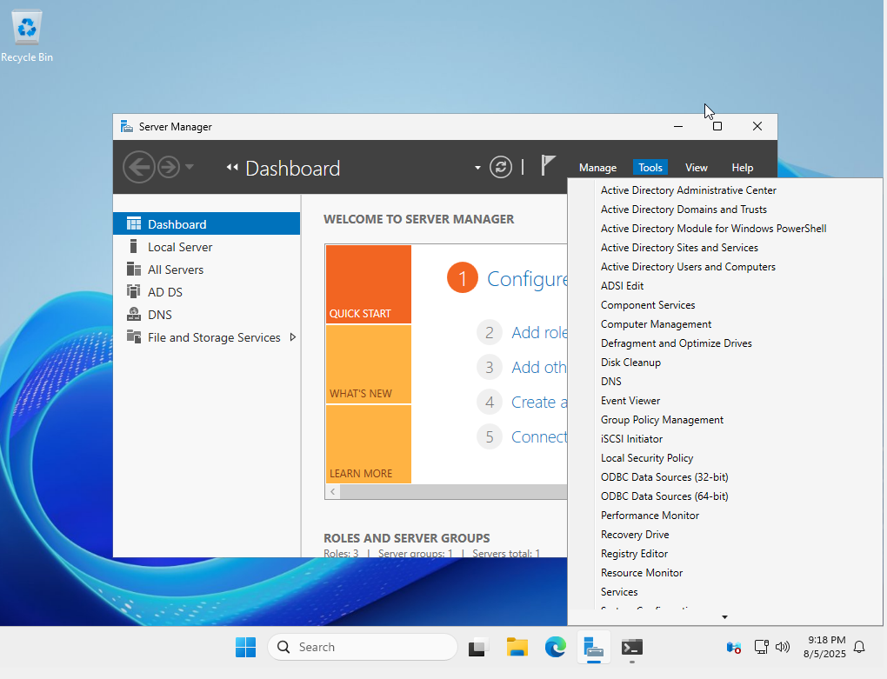
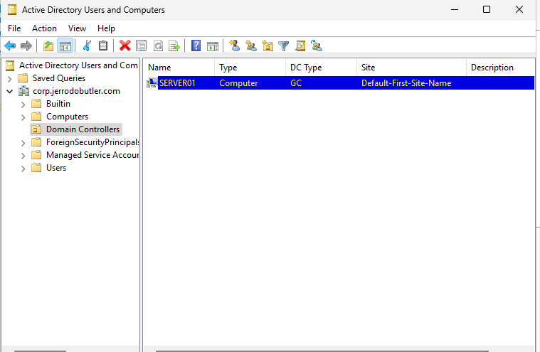
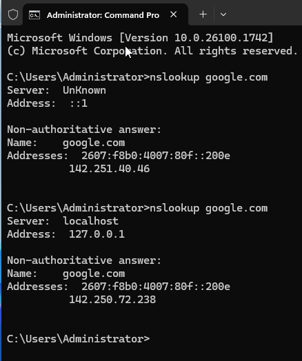

# Active Directory Domain Services (ADDS) Installation

## Objective
Install and configure Active Directory Domain Services on Windows Server 2025 to create a functional domain controller for the bridged virtual lab environment.

## What I Learned
- **Server Roles vs. Features**: Roles define the primary function of the server (e.g., ADDS, DNS), while features are optional add-ons (e.g.Group Policy Management Console).
- **Active Directory Domain Services (ADDS)** enables centralized management of users, devices, and policies through domain-based architecture.
- **DNS Integration** is essential for AD to function properly. AD-integrated DNS allows domain clients to locate services and controllers.

## Steps Completed
1. Launched **Server Manager**
2. Added the **Active Directory Domain Services** role
3. Promoted server to a **Domain Controller**
4. Created a new forest: `corp.jerrodobutler.com`
5. Verified domain controller setup via:
   - Server Manager → AD DS health
   - `dsa.msc` (Active Directory Users and Computers)
6. Verified DNS function using nslookup.
  
## Outcome
The server now acts as a domain controller for `corp.jerrodobutler.com`, and will support upcoming labs involving:
- Group Policy Objects (GPO)
- User and computer OU management
- Domain-joined client devices
- DNS and DHCP integration

## Screenshots

